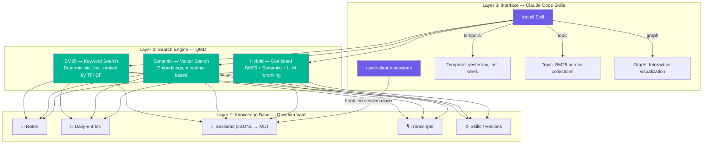
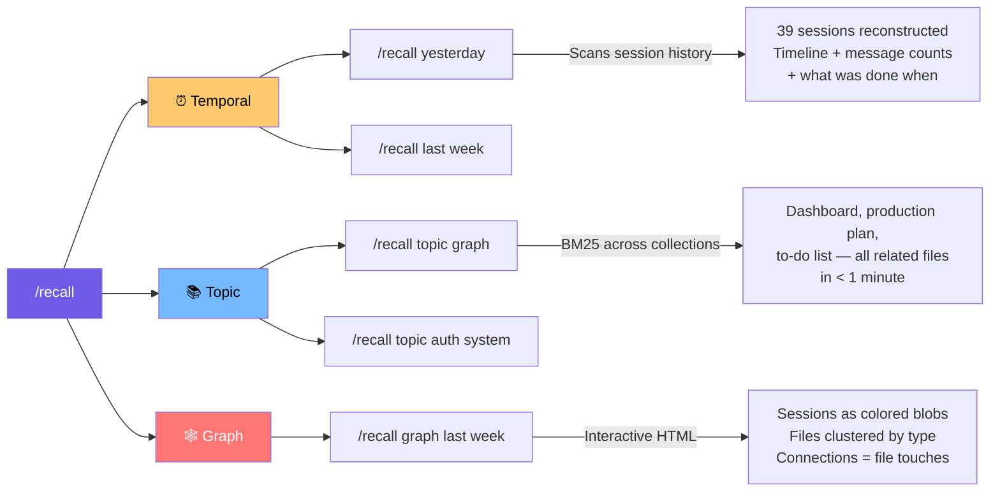
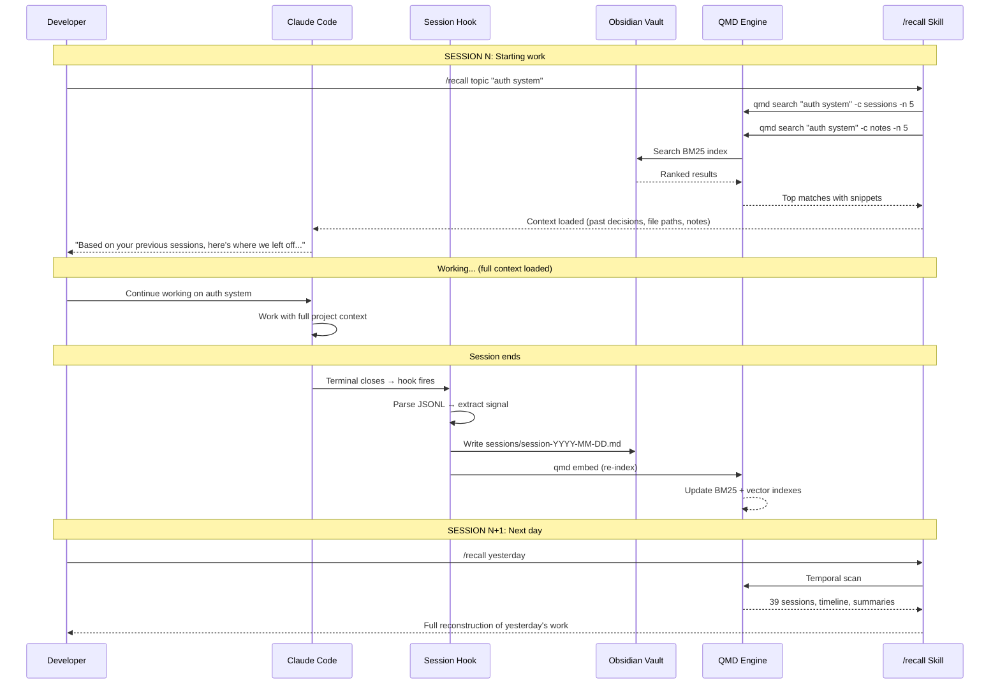

# Claude Code Development Harness: Architecture Deep Dive

## The Core Problem: Zero-State Conversations

Every conversation with Claude Code starts from zero. There is no memory between sessions — no recall of past decisions, project context, or conversation history. As sessions accumulate (700+ in weeks), developers lose track of what was done, what was decided, and where things left off. Worse, mid-session context compaction at ~60% token usage silently drops critical decisions.

```
 SESSION 1          SESSION 2          SESSION 3          SESSION N
┌───────────┐    ┌───────────┐    ┌───────────┐       ┌───────────┐
│ Decisions │    │ Decisions │    │ Decisions │  ...  │ Decisions │
│ Context   │    │ Context   │    │ Context   │       │ Context   │
│ Files     │    │ Files     │    │ Files     │       │ Files     │
└─────┬─────┘    └─────┬─────┘    └─────┬─────┘       └─────┬─────┘
      │                │                │                     │
      ▼                ▼                ▼                     ▼
   🗑️ LOST          🗑️ LOST          🗑️ LOST              🗑️ LOST

         ══════════════════════════════════════════
              No persistent memory between any sessions
         ══════════════════════════════════════════
```

**The default search approach (grep) is also broken:**
Claude Code's built-in search sends a Haiku sub-agent to grep through every file — it's slow (~3 minutes), token-expensive, and matches strings not meaning (e.g., searching "sleep" returns `sleep()` function calls alongside actual sleep notes).

---

## The Solution: A Three-Layer Memory Harness

The architecture replaces grep with a local semantic search engine (QMD), wraps it in a Claude Code skill (`/recall`), and auto-indexes sessions via hooks — creating persistent, searchable memory across all conversations.



---

## Layer 1: The Knowledge Base (Obsidian Vault)

The foundation is an Obsidian vault organized into QMD collections — each folder maps one-to-one to a searchable collection.

```
obsidian-vault/
├── notes/                    ← QMD Collection: "notes"
│   ├── project-alpha.md
│   ├── architecture-decisions.md
│   └── research/
│       └── graph-approaches.md
├── daily/                    ← QMD Collection: "daily"
│   ├── 2026-03-01.md
│   ├── 2026-03-02.md
│   └── 2026-03-03.md
├── sessions/                 ← QMD Collection: "sessions"
│   ├── session-2026-03-01-09-15.md
│   ├── session-2026-03-01-14-30.md
│   └── session-2026-03-02-08-00.md
├── transcripts/              ← QMD Collection: "transcripts"
│   └── meeting-standup-mar3.md
└── skills/                   ← QMD Collection: "skills"
    ├── recall/
    │   └── SKILL.md
    └── sync-sessions/
        └── SKILL.md
```

### Session Indexing Pipeline

Claude Code stores all conversations as JSONL files on your local machine. The raw files contain tool uses, system prompts, roles — everything. The pipeline parses out the signal (actual user messages, decisions, outcomes) and converts it to clean markdown, which QMD then indexes.

```
┌─────────────────┐     ┌──────────────────┐     ┌─────────────────┐
│  Claude Code    │     │   Parser/Hook    │     │  Obsidian Vault │
│  JSONL Sessions │────▶│  (on close)      │────▶│  sessions/*.md  │
│  ~/.claude/     │     │  Extract signal   │     │                 │
│  sessions/      │     │  Strip noise      │     │  Clean markdown │
└─────────────────┘     └──────────────────┘     └───────┬─────────┘
                                                         │
                                                         ▼
                                                  ┌─────────────┐
                                                  │  QMD Index  │
                                                  │  (embed)    │
                                                  │  BM25 + Vec │
                                                  └─────────────┘
```

---

## Layer 2: The Search Engine (QMD)

QMD is a local CLI search engine by Tobias Lutke (CEO, Shopify). It runs entirely on your machine — no cloud, no API calls. It supports three search modes that solve different problems:

### Search Mode Comparison

```
┌──────────────────────────────────────────────────────────────────────┐
│                     SEARCH MODE COMPARISON                          │
├─────────────┬────────────────────┬───────────────────────────────────┤
│  Mode       │  Command           │  How it works                    │
├─────────────┼────────────────────┼───────────────────────────────────┤
│  BM25       │  qmd search        │  Exact keyword match + ranking   │
│  (Default)  │  "query" -c notes  │  by term frequency & rarity.     │
│             │                    │  No AI. Pure math. Instant.      │
├─────────────┼────────────────────┼───────────────────────────────────┤
│  Semantic   │  qmd vsearch       │  Embedding-based. Finds meaning  │
│             │  "query" -c notes  │  even when exact words don't     │
│             │                    │  appear. Needs `qmd embed` run.  │
├─────────────┼────────────────────┼───────────────────────────────────┤
│  Hybrid     │  qmd query         │  BM25 + Semantic + LLM rerank.   │
│             │  "query"           │  Best results, slightly slower.  │
│             │                    │  The gold standard.              │
└─────────────┴────────────────────┴───────────────────────────────────┘
```

### Grep vs BM25 vs Semantic — Concrete Example

Searching for "sleep" across a vault:

```
┌─────────────────────────────────────────────────────────────────────────┐
│  GREP                          │ 200 files. Noise everywhere.          │
│  (string matching)             │ Finds: sleep(), "sleep mode",         │
│                                │ code comments, CSS classes...         │
│  ❌ No ranking. No relevance.  │ 3 minutes with Haiku sub-agent.      │
├────────────────────────────────┼───────────────────────────────────────┤
│  BM25                          │ Focused results in 2 seconds.        │
│  (keyword + ranking)           │ Ranks by frequency + rarity.         │
│                                │ A short note mentioning "sleep"      │
│  ✅ Relevance-ranked.          │ 5x scores higher than a 10K-word     │
│     No AI needed.              │ file where it appears once.          │
├────────────────────────────────┼───────────────────────────────────────┤
│  SEMANTIC                      │ Search "couldn't sleep, bad night"   │
│  (meaning-based)               │ → Finds "bedtime discipline goal"    │
│                                │ even though those exact words         │
│  ✅ Finds meaning.             │ don't appear. 4/5 results have NO    │
│     Beyond keywords.           │ matching keywords at all.            │
├────────────────────────────────┼───────────────────────────────────────┤
│  HYBRID                        │ Combines both. "couldn't sleep,      │
│  (BM25 + Semantic + rerank)    │ bad night" → returns results         │
│                                │ ranked at 89%, 51%, 42%.             │
│  ✅ Best of both worlds.       │ Best ranking of all approaches.      │
└────────────────────────────────┴───────────────────────────────────────┘
```

---

## Layer 3: The Skill Interface (/recall)

`/recall` is a Claude Code skill that sits on top of QMD. It loads context *before* you start working — instead of explaining what you were doing, you tell it to recall.

### Three Recall Modes



**Temporal** — Reconstructs session history by date. Shows timeline, message count per session, and what was done. Example: `/recall yesterday` rebuilds 39 sessions from one day.

**Topic** — BM25 search across all QMD collections in parallel. Example: `/recall topic QMD video` returns dashboard, production plan, and to-do list — all related files surfaced in under a minute.

**Graph** — Opens an interactive HTML visualization. Sessions appear as colored blobs (older ones dimmer, recent ones brighter). Files are clustered by type: goals, research, voice, docs, content, skills. Hover to highlight connections, click to select and copy file paths into Claude Code.

---

## The Automation Loop: Hooks & Sync

The magic is that the index stays fresh without manual work. A Claude Code hook fires at the end of every session, exporting and embedding the conversation into QMD automatically.

```
┌─────────────────────────────────────────────────────────────────┐
│                   AUTOMATIC SESSION PIPELINE                     │
│                                                                  │
│   You work in        Session closes     Hook fires              │
│   Claude Code   ───▶ (terminal close) ───▶ /sync-claude-sessions│
│                                             │                    │
│                                             ▼                    │
│                                      Parse JSONL                 │
│                                      Extract signal              │
│                                      Write to vault/sessions/    │
│                                             │                    │
│                                             ▼                    │
│                                      qmd embed                   │
│                                      (re-index)                  │
│                                             │                    │
│                                             ▼                    │
│                                      Index is fresh ✅           │
│                                      Next session can /recall    │
└─────────────────────────────────────────────────────────────────┘
```

---

## Cross-Device Sync Architecture

The memory layer is tool-agnostic. It works across Claude Code, OpenClaw, Gemini CLI, or any future tool — because your context lives in your vault, not in any single application.

```
┌──────────────────────────────────────────────────────────────┐
│                    YOUR CONTEXT (PORTABLE)                     │
│                                                               │
│   ┌──────────┐    Obsidian Sync    ┌──────────────────┐      │
│   │  MacBook  │◄──────────────────▶│   Mac Mini        │      │
│   │           │                    │   (always on)     │      │
│   │ Claude    │                    │   OpenClaw 24/7   │      │
│   │ Code      │                    │   QMD index       │      │
│   └──────────┘                    └──────────────────┘      │
│        │                                   ▲                  │
│        │          Same vault               │                  │
│        │          Same QMD index           │                  │
│        │          Same skills              │                  │
│        ▼                                   │                  │
│   ┌──────────┐                             │                  │
│   │  Phone   │─────── Obsidian Sync ───────┘                  │
│   │ OpenClaw │                                                │
│   └──────────┘                                                │
│                                                               │
│   Tools change. Models change. Your context stays.            │
└──────────────────────────────────────────────────────────────┘
```

---

## End-to-End Data Flow



---

## Key Design Principles

**1. Local-first** — All data, embeddings, and indexes live on your machine. No cloud dependency, no API costs for search.

**2. Tool-agnostic** — The memory layer (vault + QMD) works across any AI tool. When models or tools change, your context remains.

**3. Automatic indexing** — Session hooks ensure the index is always fresh without manual export steps.

**4. Relevance over recall** — BM25 and semantic search replace grep's brute-force string matching with ranked, meaningful results.

**5. Skill-based interface** — Claude Code natively understands skills, so `/recall` works without any special configuration — just drop it in `.claude/skills/`.

---

*Based on "Grep Is Dead: How I Made Claude Code Actually Remember Things" by Artem Zhutov (@ArtemXTech), March 2026.*
