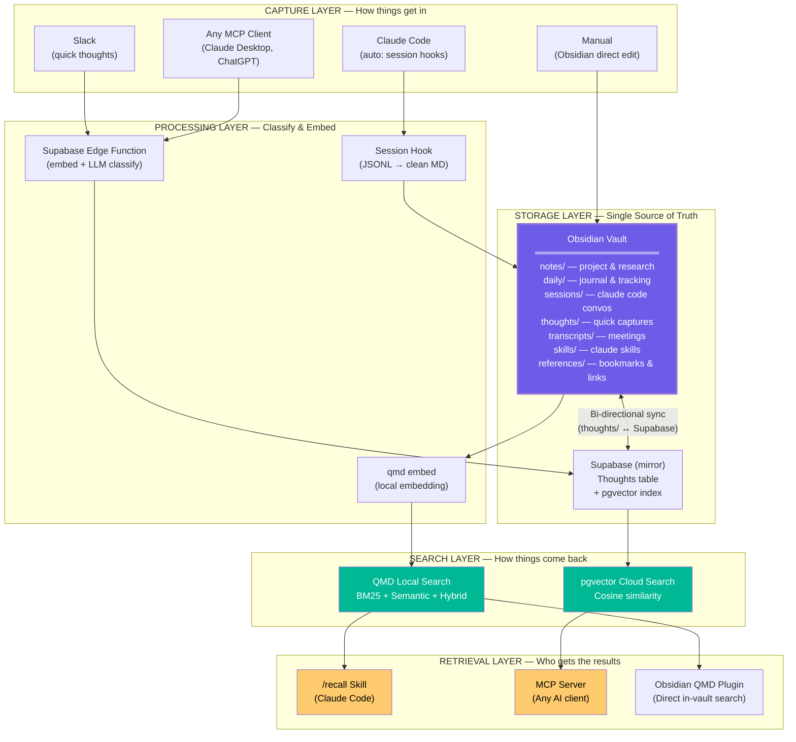
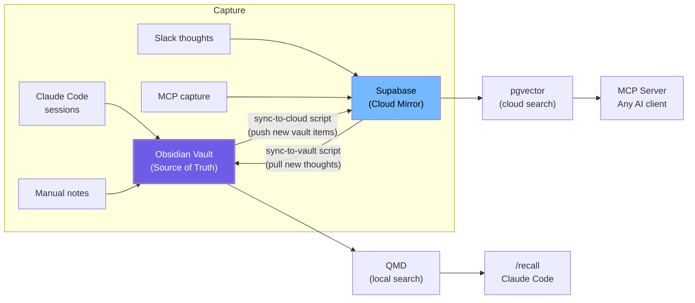

# One System, Two Purposes: Unifying the Dev Harness & Second Brain

## TL;DR — Yes, They're the Same Architecture

The Memory Harness (QMD + Obsidian) and the Second Brain (Open Brain / Supabase) solve the **exact same problem** with the **exact same pattern**. They just point at different domains — one at code sessions, the other at life thoughts. Building two separate systems would be redundant. This document shows why and how to merge them into one.

---

## The Pattern They Both Follow

Strip away the specifics and both systems are doing this:

```
┌─────────────┐     ┌──────────────┐     ┌──────────────┐     ┌─────────────┐
│   CAPTURE   │────▶│   EMBED +    │────▶│    STORE     │────▶│  RETRIEVE   │
│  (input)    │     │   CLASSIFY   │     │  (indexed)   │     │  (search)   │
└─────────────┘     └──────────────┘     └──────────────┘     └─────────────┘
```

That's it. Both are **Capture → Process → Store → Retrieve** pipelines. The only differences are *what* gets captured, *where* it's stored, and *how* you search it.

---

## Side-by-Side Comparison

```
┌─────────────────────┬──────────────────────────┬──────────────────────────┐
│  DIMENSION          │  DEV HARNESS             │  SECOND BRAIN            │
│                     │  (QMD + Obsidian)        │  (Open Brain / Supabase) │
├─────────────────────┼──────────────────────────┼──────────────────────────┤
│  Core Problem       │  Claude Code forgets     │  Your thoughts get lost  │
│                     │  between sessions        │  across tools & days     │
├─────────────────────┼──────────────────────────┼──────────────────────────┤
│  Architecture       │  Capture → Embed →       │  Capture → Embed →       │
│  Pattern            │  Store → Retrieve        │  Store → Retrieve        │
│                     │  ✅ IDENTICAL             │  ✅ IDENTICAL             │
├─────────────────────┼──────────────────────────┼──────────────────────────┤
│  Storage            │  Obsidian vault (local    │  Supabase PostgreSQL     │
│                     │  markdown files)          │  (cloud, pgvector)       │
├─────────────────────┼──────────────────────────┼──────────────────────────┤
│  Search Engine      │  QMD (BM25 + Semantic    │  pgvector cosine         │
│                     │  + Hybrid, all local)     │  similarity (cloud)      │
├─────────────────────┼──────────────────────────┼──────────────────────────┤
│  Embeddings         │  QMD's built-in          │  OpenAI text-embedding   │
│                     │  (local, no API)          │  -3-small via OpenRouter │
├─────────────────────┼──────────────────────────┼──────────────────────────┤
│  Capture Method     │  Automatic (session      │  Manual (Slack message)  │
│                     │  hooks on close)          │  or MCP tool call        │
├─────────────────────┼──────────────────────────┼──────────────────────────┤
│  Classification     │  QMD collections         │  LLM metadata extraction │
│                     │  (folder = category)      │  (type, topics, people)  │
├─────────────────────┼──────────────────────────┼──────────────────────────┤
│  Retrieval          │  /recall skill in        │  MCP tools (search,      │
│  Interface          │  Claude Code             │  list, stats, capture)   │
├─────────────────────┼──────────────────────────┼──────────────────────────┤
│  AI Clients         │  Claude Code only        │  Any MCP client (Claude  │
│  Supported          │                          │  Desktop, ChatGPT, etc.) │
├─────────────────────┼──────────────────────────┼──────────────────────────┤
│  Hosting            │  100% local              │  100% cloud (Supabase)   │
├─────────────────────┼──────────────────────────┼──────────────────────────┤
│  Cost               │  $0                      │  ~$0.10-0.30/month       │
├─────────────────────┼──────────────────────────┼──────────────────────────┤
│  Data Types         │  Code sessions, project  │  Thoughts, people,       │
│                     │  notes, decisions, docs   │  ideas, tasks, refs      │
├─────────────────────┼──────────────────────────┼──────────────────────────┤
│  Sync               │  Obsidian Sync / Git     │  Cloud-native (URL)      │
├─────────────────────┼──────────────────────────┼──────────────────────────┤
│  Offline?           │  ✅ Yes, fully           │  ❌ No (needs internet)  │
└─────────────────────┴──────────────────────────┴──────────────────────────┘
```

---

## What's Actually Different (and What's Not)

### Identical (no need to duplicate)

- **The pattern**: Capture → Embed → Store → Retrieve
- **The goal**: Persistent memory that any AI can access
- **Semantic search**: Both do vector similarity (QMD locally, pgvector in cloud)
- **Auto-classification**: Both categorize input (QMD via collections, Open Brain via LLM metadata extraction)
- **The retrieval interface**: Both expose search to AI tools (skill vs MCP)

### Genuinely Different (complementary, not conflicting)

```
  DEV HARNESS strengths:              SECOND BRAIN strengths:
  ┌─────────────────────┐             ┌──────────────────────────┐
  │ ✅ Local-first       │             │ ✅ Quick capture (Slack)  │
  │ ✅ Free forever      │             │ ✅ Any-AI access (MCP)    │
  │ ✅ Offline works     │             │ ✅ Rich metadata (LLM)    │
  │ ✅ Code session auto │             │ ✅ Cloud = always on      │
  │ ✅ BM25 + Hybrid     │             │ ✅ Mobile-friendly        │
  │ ✅ Graph visual.     │             │ ✅ Weekly review ritual    │
  └─────────────────────┘             └──────────────────────────┘
```

These strengths don't conflict — they complement. The dev harness is great at auto-capturing coding work locally. The second brain is great at quick-capturing thoughts from anywhere. A unified system would use both.

---

## The Unified Architecture

### Design Principle: Obsidian Vault as the Single Source of Truth

Everything flows into and out of one Obsidian vault. QMD indexes it locally. An optional cloud sync layer (Supabase) enables capture from Slack and access from any MCP client. The vault is the brain — everything else is a window into it.



### How Sync Works Between Local and Cloud

The vault is primary. Supabase is a mirror for cloud access. A simple sync script keeps them aligned:

```
┌──────────────────────────────────────────────────────────────────────┐
│                    SYNC FLOW                                         │
│                                                                      │
│  LOCAL → CLOUD:                                                      │
│  ┌────────────┐    ┌──────────────┐    ┌─────────────────┐          │
│  │ New file in │───▶│ Sync script  │───▶│ Supabase insert │          │
│  │ vault/      │    │ reads MD +   │    │ with embedding  │          │
│  │ thoughts/   │    │ calls embed  │    │ + metadata      │          │
│  └────────────┘    └──────────────┘    └─────────────────┘          │
│                                                                      │
│  CLOUD → LOCAL:                                                      │
│  ┌────────────┐    ┌──────────────┐    ┌─────────────────┐          │
│  │ New Slack   │───▶│ Edge Func    │───▶│ Supabase stores │          │
│  │ message     │    │ embeds +     │    │                 │          │
│  └────────────┘    │ classifies   │    └────────┬────────┘          │
│                    └──────────────┘             │                    │
│                                                 ▼                    │
│                                          ┌─────────────┐            │
│                                          │ Sync script  │            │
│                                          │ pulls new    │            │
│                                          │ thoughts →   │            │
│                                          │ vault/       │            │
│                                          │ thoughts/    │            │
│                                          └──────┬──────┘            │
│                                                 │                    │
│                                                 ▼                    │
│                                          ┌─────────────┐            │
│                                          │ qmd embed   │            │
│                                          │ (re-index)  │            │
│                                          └─────────────┘            │
└──────────────────────────────────────────────────────────────────────┘
```

---

## Unified Vault Structure

One vault. All content types. Each folder = one QMD collection.

```
unified-vault/
│
├── notes/                    # Project research, architecture, learning
│   ├── project-alpha/
│   │   ├── architecture.md
│   │   └── decisions-log.md
│   └── research/
│       └── graph-databases.md
│
├── daily/                    # Daily journal (weekly tracking lives here)
│   ├── 2026-03-01.md         # What happened, energy, mood, blockers
│   ├── 2026-03-02.md
│   └── templates/
│       └── daily-template.md
│
├── sessions/                 # Auto-captured Claude Code sessions
│   ├── session-2026-03-04-09-15.md
│   └── session-2026-03-04-14-30.md
│
├── thoughts/                 # Quick captures (from Slack / MCP / phone)
│   ├── thought-2026-03-04-08-22.md
│   └── thought-2026-03-04-12-45.md
│
├── people/                   # Person notes (from second brain)
│   ├── sarah.md
│   └── raj.md
│
├── transcripts/              # Meeting notes, voice memos
│   └── standup-2026-03-04.md
│
├── references/               # Bookmarks, articles, saved links
│   └── vector-search-comparison.md
│
├── weekly-reviews/           # Weekly reflection & tracking
│   ├── 2026-W09.md
│   └── templates/
│       └── weekly-template.md
│
└── skills/                   # Claude Code skills
    ├── recall/
    │   └── SKILL.md
    └── sync-sessions/
        └── SKILL.md
```

### QMD Collections Mapping

```bash
# Register every folder as a searchable collection
qmd collection add ~/unified-vault/notes          --name notes
qmd collection add ~/unified-vault/daily          --name daily
qmd collection add ~/unified-vault/sessions       --name sessions
qmd collection add ~/unified-vault/thoughts       --name thoughts
qmd collection add ~/unified-vault/people         --name people
qmd collection add ~/unified-vault/transcripts    --name transcripts
qmd collection add ~/unified-vault/references     --name references
qmd collection add ~/unified-vault/weekly-reviews --name weekly

# Build the full index
qmd embed
```

---

## What You Gain By Unifying

### 1. Cross-Domain Search

With separate systems, a search in the dev harness can't find your second brain thoughts, and vice versa. Unified, everything is connected:

```
  QUERY: "what was my approach to the auth system?"

  SEPARATE SYSTEMS:                      UNIFIED SYSTEM:
  ┌────────────────────┐                 ┌───────────────────────────┐
  │ Dev harness finds:  │                 │ Finds ALL of these:       │
  │  - session logs     │                 │  - session logs           │
  │  - code decisions   │                 │  - code decisions         │
  │                     │                 │  - a Slack thought: "auth │
  │ Second brain finds: │                 │    should use JWT not     │
  │  - a quick thought  │                 │    sessions — simpler"    │
  │    about auth       │                 │  - daily entry: "spent    │
  │  - a daily note     │                 │    3h on auth, blocked    │
  │                     │                 │    by CORS issue"         │
  │ ❌ No cross-search   │                 │  - meeting transcript     │
  └────────────────────┘                 │    mentioning auth scope  │
                                          │                           │
                                          │ ✅ Full picture, one query│
                                          └───────────────────────────┘
```

### 2. Weekly Reviews Pull From Everything

Your weekly review template can reference dev sessions, quick thoughts, daily entries, and meeting notes — all in one search:

```
  /recall topic "this week's work"
  → Sessions: 42 Claude Code conversations
  → Thoughts: 15 quick captures from Slack
  → Daily: 5 journal entries
  → Transcripts: 2 meeting notes
  → Everything ranked by relevance, in one response
```

### 3. One Maintenance Burden, Not Two

```
  SEPARATE:                              UNIFIED:
  ┌──────────────────────┐               ┌──────────────────────┐
  │ Maintain QMD index   │               │ Maintain ONE QMD     │
  │ Maintain Supabase DB │               │ index (+ optional    │
  │ Two backup strategies│               │ Supabase mirror)     │
  │ Two sync systems     │               │ One backup strategy  │
  │ Two search interfaces│               │ One Obsidian Sync    │
  │ Two mental models    │               │ One /recall covers   │
  │                      │               │ everything           │
  └──────────────────────┘               └──────────────────────┘
```

---

## How to Plug Supabase Into the QMD+Obsidian System

You don't replace the Open Brain cloud layer — you add it as a **secondary sync target** for the Obsidian vault. The vault remains the source of truth.

### Option A: Vault-Primary (Recommended)

Everything lives in the vault first. Supabase mirrors what it needs for cloud/MCP access.



### Option B: Dual-Write (Simpler, Less Offline-Friendly)

Every capture writes to both vault and Supabase simultaneously. No sync script needed, but you depend on internet for Slack captures.

### Option C: Cloud-Primary (If You Prioritize Mobile)

Supabase is the source of truth. A nightly script pulls everything into the vault for QMD indexing. Good if most of your captures come from Slack/phone.

**Recommendation**: Start with Option A. It gives you the best of both worlds — full offline capability with the dev harness, plus cloud access when you need Slack capture or MCP from other AI tools.

---

## The Unified /recall Skill (Enhanced)

The `/recall` skill expands to cover both dev and second brain content:

```
/recall yesterday          → Sessions + daily entry + thoughts from yesterday
/recall topic "auth"       → Sessions + notes + thoughts + transcripts about auth
/recall people "sarah"     → All mentions of Sarah across everything
/recall week               → Weekly review: sessions, thoughts, daily, meetings
/recall graph last week    → Visual: sessions + thoughts as connected nodes
/recall ideas              → All thoughts typed as "idea" across the vault
/recall actions            → All open action items from thoughts + daily entries
```

This is the key win: **one command surfaces everything, regardless of where it was captured.**

---

## Does This Route Make Sense? — Decision Matrix

```
┌────────────────────────────────┬─────────┬───────────┬──────────┐
│  QUESTION                      │  YES    │  PARTIAL  │  NO      │
├────────────────────────────────┼─────────┼───────────┼──────────┤
│  Same architecture pattern?    │  ✅      │           │          │
│  Same core problem?            │  ✅      │           │          │
│  Data types overlap?           │         │  ✅ *      │          │
│  Search needs overlap?         │  ✅      │           │          │
│  Retrieval interface overlap?  │  ✅      │           │          │
│  Can QMD handle both?          │  ✅      │           │          │
│  Can one vault hold both?      │  ✅      │           │          │
│  Reduces maintenance?          │  ✅      │           │          │
│  Loses any capability?         │         │           │  ✅ **   │
│  Worth building separately?    │         │           │  ✅      │
└────────────────────────────────┴─────────┴───────────┴──────────┘

*  Data types differ (code sessions vs personal thoughts) but the
   storage format (markdown + metadata) is identical.

** You lose nothing. Supabase still handles cloud/MCP access. QMD
   still handles local search. They just share the same vault.
```

**Verdict: One system. Two purposes. Zero redundancy.**

---

## Implementation Priority

If you're building from scratch, this is the order:

```
  PHASE 1: Foundation (Day 1)
  ├── Set up Obsidian vault with unified folder structure
  ├── Install QMD, register all collections
  └── Create /recall skill

  PHASE 2: Dev Harness (Day 1-2)
  ├── Set up session sync hook (JSONL → vault/sessions/)
  ├── Test: /recall topic, /recall yesterday
  └── Verify cross-session memory works

  PHASE 3: Second Brain Capture (Day 2-3)
  ├── Set up Supabase project + thoughts table
  ├── Deploy Slack capture Edge Function
  ├── Create sync-to-vault script (Supabase → vault/thoughts/)
  └── Test: Slack message appears in vault, QMD finds it

  PHASE 4: Cloud Access (Day 3-4)
  ├── Deploy MCP server Edge Function
  ├── Connect Claude Desktop / ChatGPT
  ├── Create sync-to-cloud script (vault → Supabase)
  └── Test: MCP search finds vault notes + Slack thoughts

  PHASE 5: Weekly Ritual (Day 5+)
  ├── Create weekly review template
  ├── Enhance /recall with "week" and "actions" modes
  └── Start using it. Iterate.
```

---

*The best system is one you actually use. Don't build two half-used systems when one unified one covers everything.*
