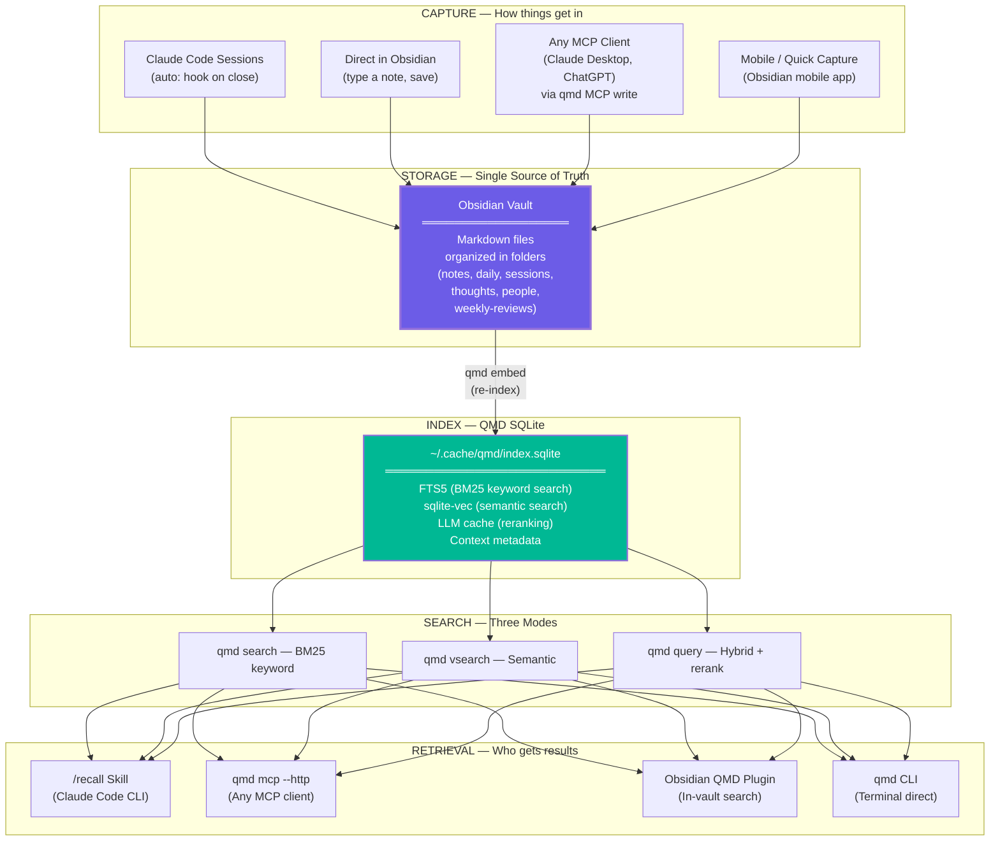
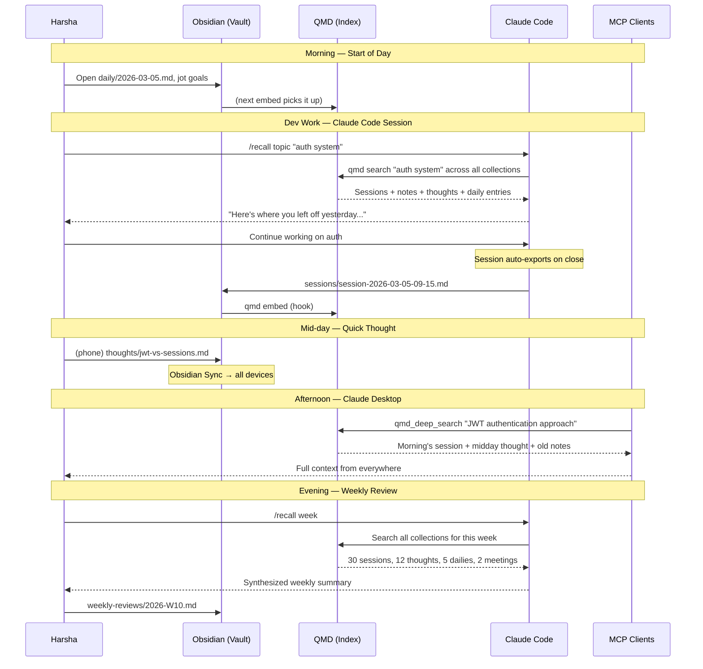

# The Unified System: One Vault, One Index, Everything Works

## Why This Document Exists

The previous comparison (Document 04) proposed keeping Supabase as a cloud mirror alongside QMD. After digging into QMD's actual internals, that's unnecessary overhead. QMD already has everything the Second Brain needs — SQLite storage, vector embeddings, semantic search, metadata, AND a built-in MCP server. Postgres, Edge Functions, OpenRouter — all of it can go. The architecture collapses into something beautifully simple.

---

## The Realization: QMD Already IS a Second Brain Engine

Here's what QMD stores in a single `~/.cache/qmd/index.sqlite` file:

```
┌─────────────────────────────────────────────────────────────┐
│              QMD SQLite Database Schema                      │
│              ~/.cache/qmd/index.sqlite                       │
├─────────────────────────────────────────────────────────────┤
│                                                             │
│  collections      → Indexed directories + glob patterns     │
│  documents        → Full markdown content + metadata         │
│  documents_fts    → FTS5 full-text index (BM25 search)      │
│  content_vectors  → 800-token chunks w/ 15% overlap         │
│  vectors_vec      → sqlite-vec vector index (semantic)      │
│  path_contexts    → Hierarchical context descriptions       │
│  llm_cache        → Cached query expansion + rerank scores  │
│                                                             │
└─────────────────────────────────────────────────────────────┘
```

Compare this to what the Second Brain's Supabase was providing:

```
  Supabase "thoughts" table:        QMD already has:
  ┌──────────────────────┐          ┌──────────────────────────┐
  │ content (text)       │    =     │ documents (full content)  │
  │ embedding (vector)   │    =     │ content_vectors + vec idx │
  │ metadata (jsonb)     │    =     │ path_contexts + FTS5      │
  │ match_thoughts()     │    =     │ qmd search/vsearch/query  │
  │ created_at           │    =     │ file timestamps in vault  │
  └──────────────────────┘          └──────────────────────────┘
```

**Every capability of the Supabase Second Brain is already native in QMD.** And QMD adds things Supabase didn't have: BM25 ranking, hybrid search with LLM reranking, and a built-in MCP server.

---

## What Gets Eliminated

```
  ┌───────────────────────────────────────────────────────────────┐
  │  REMOVED (no longer needed)         WHY                       │
  ├───────────────────────────────────────────────────────────────┤
  │  Supabase project                   QMD SQLite does it all   │
  │  PostgreSQL + pgvector              sqlite-vec replaces it   │
  │  OpenRouter API key                 QMD uses local GGUF      │
  │  Edge Function (ingest-thought)     Files in vault = capture │
  │  Edge Function (MCP server)         qmd mcp --http replaces  │
  │  Slack bot + app + OAuth            See "Capture" below      │
  │  ~$0.30/month API costs             $0, everything local     │
  │  Supabase CLI                       Not needed               │
  │  Deno runtime                       Not needed               │
  │  Cloud sync scripts                 Obsidian Sync only       │
  │  Two mental models                  ONE system               │
  └───────────────────────────────────────────────────────────────┘
```

---

## The Final Architecture



### The Simplicity

Count the moving parts:

```
  OLD (two separate systems):          NEW (unified):
  ┌──────────────────────────┐         ┌──────────────────────┐
  │ 1. Obsidian vault        │         │ 1. Obsidian vault    │
  │ 2. QMD CLI               │         │ 2. QMD               │
  │ 3. Supabase project      │         │                      │
  │ 4. PostgreSQL + pgvector │         │ That's it.           │
  │ 5. OpenRouter account    │         │                      │
  │ 6. Slack app + bot       │         │ Two components.      │
  │ 7. Edge Function x2      │         │ Everything local.    │
  │ 8. Sync scripts x2       │         │ $0 forever.          │
  │ 9. MCP access keys       │         └──────────────────────┘
  │ 10. Supabase CLI         │
  └──────────────────────────┘
```

---

## The Vault: One Folder Structure, All Purposes

```
~/vault/
│
├── notes/                        # Dev: architecture, research, learning
│   ├── project-alpha/
│   │   ├── architecture.md
│   │   └── decisions.md
│   └── research/
│       └── graph-databases.md
│
├── daily/                        # Brain: daily journal, energy, mood
│   ├── 2026-03-04.md             #   also tracks dev standup items
│   └── templates/
│       └── daily-template.md
│
├── sessions/                     # Dev: auto-captured Claude Code sessions
│   ├── session-2026-03-04-09-15.md
│   └── session-2026-03-04-14-30.md
│
├── thoughts/                     # Brain: quick captures, ideas, observations
│   ├── 2026-03-04-idea-auth-jwt.md
│   └── 2026-03-04-person-sarah.md
│
├── people/                       # Brain: person notes, relationship context
│   ├── sarah.md
│   └── raj.md
│
├── transcripts/                  # Both: meeting notes, voice memos
│   └── standup-2026-03-04.md
│
├── references/                   # Both: bookmarks, articles, saved content
│   └── vector-search-comparison.md
│
├── weekly-reviews/               # Brain: weekly reflection and tracking
│   ├── 2026-W10.md
│   └── templates/
│       └── weekly-template.md
│
└── skills/                       # Dev: Claude Code skills
    ├── recall/
    │   └── SKILL.md
    └── sync-sessions/
        └── SKILL.md
```

### QMD Collection Registration (One-Time Setup)

```bash
# Register every folder as a named collection
qmd collection add ~/vault/notes           --name notes
qmd collection add ~/vault/daily           --name daily
qmd collection add ~/vault/sessions        --name sessions
qmd collection add ~/vault/thoughts        --name thoughts
qmd collection add ~/vault/people          --name people
qmd collection add ~/vault/transcripts     --name transcripts
qmd collection add ~/vault/references      --name references
qmd collection add ~/vault/weekly-reviews  --name weekly

# Add context so QMD (and AI clients) understand what each collection is
qmd context add qmd://notes          "Project notes, architecture decisions, research"
qmd context add qmd://daily          "Daily journal entries, standup logs, mood and energy"
qmd context add qmd://sessions       "Claude Code conversation exports, coding sessions"
qmd context add qmd://thoughts       "Quick captures: ideas, observations, tasks, person notes"
qmd context add qmd://people         "People profiles, relationship notes, contact context"
qmd context add qmd://transcripts    "Meeting transcripts, voice memos, call notes"
qmd context add qmd://references     "Bookmarks, articles, external resources"
qmd context add qmd://weekly         "Weekly reviews, goal tracking, reflections"

# Build the full index (BM25 + embeddings)
qmd embed
```

---

## Capture: How Things Get In

### 1. Claude Code Sessions (Automatic)

A hook fires when each session closes, parsing JSONL into clean markdown and dropping it in `vault/sessions/`. Then `qmd embed` re-indexes.

```bash
# ~/.claude/hooks.json (or equivalent hook config)
# On session close → parse + export + re-index
```

### 2. Quick Thoughts (Obsidian Mobile or Desktop)

No Slack needed. Open Obsidian on your phone, create a note in `thoughts/`, type your thought, save. Obsidian Sync pushes it to all devices. Next `qmd embed` picks it up.

For even faster capture, use Obsidian's "Daily Notes" or "QuickAdd" community plugin — one tap, type, done.

### 3. From Any AI Client (QMD's Built-In MCP)

QMD exposes an MCP server natively. Any MCP-compatible client (Claude Desktop, ChatGPT, Cursor) can search AND write to your vault:

```bash
# Start MCP server (long-lived, models stay in VRAM)
qmd mcp --http --daemon    # Runs on localhost:8181

# Or configure stdio for Claude Desktop:
# ~/Library/Application Support/Claude/claude_desktop_config.json
{
  "mcpServers": {
    "qmd": {
      "command": "qmd",
      "args": ["mcp"]
    }
  }
}
```

**MCP Tools exposed automatically:**

```
┌─────────────────────┬───────────────────────────────────────────┐
│  MCP Tool           │  What it does                             │
├─────────────────────┼───────────────────────────────────────────┤
│  qmd_search         │  BM25 keyword search across collections  │
│  qmd_vector_search  │  Semantic similarity search              │
│  qmd_deep_search    │  Hybrid + query expansion + reranking    │
│  qmd_get            │  Retrieve full doc by path or docid      │
│  qmd_multi_get      │  Batch retrieve by glob or list          │
│  qmd_status         │  Index health and collection info        │
│  (write tools)      │  AI clients can create files in vault    │
└─────────────────────┴───────────────────────────────────────────┘
```

### 4. Direct in Obsidian

Just open Obsidian and type. Notes, daily entries, people profiles, references. The vault IS the database.

---

## Search: How Things Come Back

### From Claude Code (via /recall Skill)

```bash
/recall yesterday           # Temporal: sessions + daily + thoughts from yesterday
/recall topic "auth system" # Topic: BM25 across ALL collections
/recall people "sarah"      # Person: everything mentioning Sarah
/recall week                # Weekly: this week's sessions + thoughts + daily
/recall ideas               # Type: all thoughts tagged as ideas
```

Under the hood, `/recall` just runs QMD commands:

```bash
# What /recall topic "auth system" actually executes:
qmd search "auth system" -c sessions -n 5 --json
qmd search "auth system" -c notes -n 5 --json
qmd search "auth system" -c thoughts -n 3 --json
qmd search "auth system" -c daily -n 3 --json
# Claude synthesizes and presents the combined results
```

### From Any AI Client (via QMD MCP)

Claude Desktop, ChatGPT, or any MCP client connects to `localhost:8181/mcp` and can call `qmd_search`, `qmd_vector_search`, or `qmd_deep_search` directly. No Edge Functions, no API keys, no cloud.

### From Obsidian (via QMD Plugin)

The community Obsidian QMD plugin provides in-vault search with a native UI. Search your entire knowledge base without leaving Obsidian.

### From Terminal (Direct CLI)

```bash
qmd query "what was my approach to the auth system"
qmd vsearch "feeling stuck on the project" -c daily -n 5
qmd search "sarah" -c people --full
```

---

## The Migration/New Machine Playbook

This is the key insight you mentioned, Harsha — when you move to a new machine, the only thing that matters is your vault and QMD. Here's the complete playbook:

```
┌──────────────────────────────────────────────────────────────┐
│            NEW MACHINE SETUP (15 minutes)                     │
│                                                              │
│  Step 1: Install Obsidian                                    │
│          → Sign in → Obsidian Sync pulls your vault          │
│          → All your markdown files are now local             │
│                                                              │
│  Step 2: Install QMD                                         │
│          npm install -g @tobilu/qmd                           │
│          (auto-downloads ~1.9GB GGUF models on first use)    │
│                                                              │
│  Step 3: Run the setup script (see below)                    │
│          → Registers all collections                         │
│          → Adds all context descriptions                     │
│          → Builds the full index                             │
│                                                              │
│  Step 4: Done. Everything works.                             │
│          → /recall finds all your sessions                   │
│          → qmd mcp serves to any AI client                   │
│          → Your entire history is searchable                 │
└──────────────────────────────────────────────────────────────┘
```

### The Setup Script: `setup-brain.sh`

One script that takes your vault from "just markdown files" to "fully indexed and searchable." Run once per machine.

```bash
#!/bin/bash
# setup-brain.sh — Bootstrap QMD on any new machine
# Usage: ./setup-brain.sh ~/vault

set -e

VAULT="${1:-$HOME/vault}"

if [ ! -d "$VAULT" ]; then
    echo "Error: Vault not found at $VAULT"
    echo "Usage: ./setup-brain.sh /path/to/your/vault"
    exit 1
fi

echo "=== Setting up QMD for vault: $VAULT ==="

# Register collections (idempotent — safe to re-run)
declare -A COLLECTIONS=(
    ["notes"]="$VAULT/notes"
    ["daily"]="$VAULT/daily"
    ["sessions"]="$VAULT/sessions"
    ["thoughts"]="$VAULT/thoughts"
    ["people"]="$VAULT/people"
    ["transcripts"]="$VAULT/transcripts"
    ["references"]="$VAULT/references"
    ["weekly"]="$VAULT/weekly-reviews"
)

for name in "${!COLLECTIONS[@]}"; do
    path="${COLLECTIONS[$name]}"
    if [ -d "$path" ]; then
        echo "  Adding collection: $name → $path"
        qmd collection add "$path" --name "$name" 2>/dev/null || true
    else
        echo "  Skipping $name (folder $path not found)"
    fi
done

# Add context descriptions
echo ""
echo "=== Adding context descriptions ==="
qmd context add qmd://notes       "Project notes, architecture decisions, research"
qmd context add qmd://daily       "Daily journal, standup, mood, energy, blockers"
qmd context add qmd://sessions    "Claude Code session exports, coding conversations"
qmd context add qmd://thoughts    "Quick captures: ideas, observations, tasks"
qmd context add qmd://people      "People profiles, relationship notes"
qmd context add qmd://transcripts "Meeting transcripts, voice memos"
qmd context add qmd://references  "Bookmarks, articles, external resources"
qmd context add qmd://weekly      "Weekly reviews, goal tracking, reflections"

# Build the full index
echo ""
echo "=== Building index (this may take a few minutes) ==="
qmd embed

# Verify
echo ""
echo "=== Status ==="
qmd status

echo ""
echo "=== Done! Your brain is indexed. ==="
echo "Try: qmd query \"what have I been working on\""
echo "MCP: qmd mcp --http --daemon"
```

### What Travels vs What Gets Rebuilt

```
  ┌──────────────────────────┬───────────────────────────────────┐
  │  TRAVELS                 │  REBUILT LOCALLY                  │
  │  (via Obsidian Sync)     │  (by setup-brain.sh)              │
  ├──────────────────────────┼───────────────────────────────────┤
  │  All markdown files      │  QMD SQLite index                 │
  │  Folder structure        │  FTS5 full-text index             │
  │  File timestamps         │  Vector embeddings                │
  │  Obsidian settings       │  LLM cache                        │
  │  .obsidian/ config       │  Collection registrations         │
  │  Skills (in vault)       │  Context descriptions             │
  │                          │  GGUF models (~1.9GB)             │
  ├──────────────────────────┼───────────────────────────────────┤
  │  SIZE: Your content      │  SIZE: ~2GB (models) + index      │
  │  (whatever your vault is)│  TIME: ~15 min first run          │
  └──────────────────────────┴───────────────────────────────────┘
```

The QMD index is a derived artifact — it's built FROM the markdown files, not stored alongside them. This means the vault itself is the complete, portable source of truth. The index is disposable and rebuildable.

---

## End-to-End Flow: A Day in the Life



---

## What About Slack Capture?

You might wonder: without Supabase Edge Functions, do we lose the Slack quick-capture? Technically yes — the auto-embed-on-message pipeline goes away. But here's why that's fine:

**Obsidian Mobile replaces Slack for quick capture.** Open app → type in `thoughts/` → save. Obsidian Sync pushes it everywhere. Same friction as typing in Slack, but the thought goes directly into your vault — no intermediate cloud database, no sync scripts, no API costs.

If you *really* want Slack capture, you could set up a lightweight webhook that writes a `.md` file to your vault folder (a simple Node/Python script), but most people find Obsidian mobile is simpler.

---

## QMD's Hybrid Search: Why It's Better Than pgvector

The Second Brain used pgvector cosine similarity — one search mode. QMD gives you three, and the hybrid mode is significantly more sophisticated:

```
  pgvector (Second Brain):           QMD Hybrid (Unified):
  ┌──────────────────────────┐       ┌──────────────────────────────────┐
  │ 1. Embed query           │       │ 1. Query expansion (LLM variant) │
  │ 2. Cosine similarity     │       │ 2. Parallel: BM25 + vector       │
  │ 3. Threshold filter      │       │ 3. Reciprocal Rank Fusion (k=60) │
  │ 4. Return top N          │       │ 4. Top-rank bonus scoring        │
  │                          │       │ 5. LLM reranking (top 30)        │
  │ One dimension of search  │       │ 6. Position-aware blending       │
  │                          │       │                                  │
  │                          │       │ Three dimensions, fused + ranked │
  └──────────────────────────┘       └──────────────────────────────────┘
```

---

## The Bootstrap Script Also Goes in Your Vault

Here's the elegant part — put `setup-brain.sh` inside your vault:

```
~/vault/
├── _bootstrap/
│   ├── setup-brain.sh         # The setup script
│   └── README.md              # "Run this on a new machine"
├── notes/
├── daily/
...
```

Now when you sync your vault to a new machine, the setup instructions travel with it. Your vault is completely self-contained and self-documenting.

---

## Summary: The Complete Stack

```
┌─────────────────────────────────────────────────────────────────┐
│                                                                 │
│   YOUR UNIFIED SYSTEM                                           │
│                                                                 │
│   ┌─────────────────────────────────────────────────────────┐   │
│   │  Obsidian Vault (source of truth)                       │   │
│   │  → Markdown files in organized folders                  │   │
│   │  → Syncs via Obsidian Sync to all devices               │   │
│   └────────────────────────┬────────────────────────────────┘   │
│                            │                                    │
│                      qmd embed                                  │
│                            │                                    │
│   ┌────────────────────────▼────────────────────────────────┐   │
│   │  QMD Index (derived, rebuildable)                       │   │
│   │  → SQLite: FTS5 + sqlite-vec + LLM cache               │   │
│   │  → BM25 / Semantic / Hybrid search                      │   │
│   │  → Built-in MCP server (localhost:8181)                 │   │
│   └────────────────────────┬────────────────────────────────┘   │
│                            │                                    │
│              ┌─────────────┼──────────────┐                     │
│              │             │              │                      │
│         /recall       qmd mcp        Obsidian                   │
│       (Claude Code)  (Any AI)     (QMD Plugin)                  │
│                                                                 │
│   Cost: $0        Hosting: Local       Portability: Vault only  │
│                                                                 │
└─────────────────────────────────────────────────────────────────┘
```

**Two components. Zero cloud. Infinitely portable. One sync to rule them all.**
