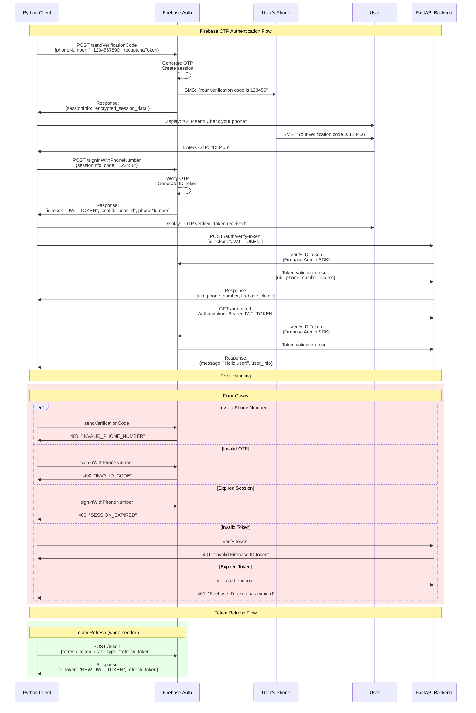

Key Components
1. Python Client (client.py)

Uses Firebase Auth REST API directly
Sends OTP request to Firebase (Firebase sends real SMS)
Collects OTP from user input
Verifies OTP with Firebase to get ID token
Sends ID token to your backend for validation

2. FastAPI Backend (main.py)

Receives Firebase ID tokens from clients
Uses Firebase Admin SDK to verify token authenticity
Provides protected endpoints that require valid tokens
Returns user information after token validation

3. Real SMS Flow

Firebase actually sends SMS to the phone number
User receives real OTP on their phone
No simulation - actual Firebase authentication

Authentication Flow

Client → Firebase: "Send OTP to +1234567890"
Firebase → Phone: Sends real SMS with OTP
User → Client: Enters OTP received on phone
Client → Firebase: "Verify OTP code 123456"
Firebase → Client: Returns JWT ID token
Client → Backend: "Verify this token"
Backend → Firebase: Validates token using Admin SDK
Backend → Client: Returns user info if valid

Key Differences from Previous Version

Real Firebase Auth: Uses Firebase Authentication service directly
Real SMS: Firebase sends actual SMS messages
ID Tokens: Uses Firebase ID tokens (JWT) instead of custom tokens
REST API: Client uses Firebase Auth REST API
Admin SDK: Backend uses Firebase Admin SDK for verification

Setup Requirements

Firebase Console Configuration:

Enable Phone Authentication
Get Web App API key
Download service account key

Update Configuration:

Replace firebase_config in client with your actual Firebase config
Place service account JSON file in project root

Test with Real Phone:

Use your actual phone number
Receive real SMS from Firebase
Enter the actual OTP code

This is a production-ready implementation that uses Firebase's actual authentication infrastructure. The sequence diagram shows the complete flow including error handling scenarios.

